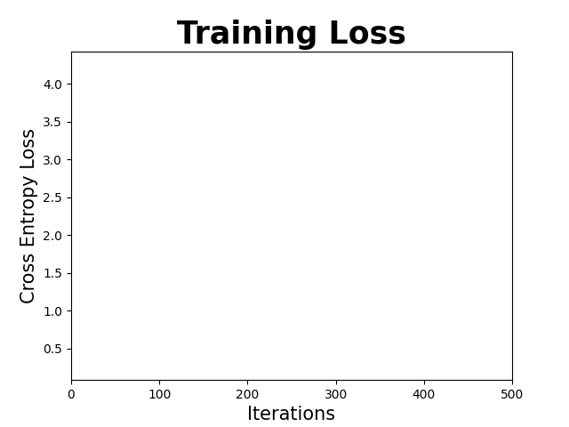

# 🌸 FloraNet — Flower Classification with a Custom ResNet (PyTorch)

## 1) Brief Introduction

FloraNet is a from-scratch deep learning framework for multi-class flower classification built using the Oxford 102 Flowers dataset. The project implements a custom ResNet-style convolutional neural network in PyTorch and trains it end-to-end without relying on transfer learning or pretrained weights.

The primary goal of FloraNet is to provide a clear, modular, and reproducible implementation of a modern convolutional architecture while emphasizing architectural understanding over fine-tuning existing models. The codebase is organized to separate data handling, model design, training, evaluation, and visualization, making experimentation and extension straightforward.

The training pipeline supports mixed-precision computation, gradient clipping, cosine annealing learning rate scheduling, and multiple optimizers. Model performance is evaluated using accuracy and macro F1-score, and all metrics are logged and visualized through automatically generated plots and animations.

FloraNet is intended as an educational and research-oriented baseline for studying residual networks and large-scale image classification from first principles, while still achieving competitive performance.

---

## 2) Motivation
I wanted to build a system that can automatically recognize and classify flowers from images, and to understand how residual networks work by implementing and training one from scratch. Moreover, I wanted to learn how to build a Computer Vision Model from Scratch.

---

## 3) Project Structure

FloraNet/
├── requirements.txt  
├── src/  
│   ├── data_builder.py  
│   ├── main.py  
│   ├── model.py  
│   ├── metrics.py  
│   └── visuals.py  
├── data/  
│   └── flowers-102/  
├── data analysis/  
│   ├── data_analysis.ipynb  
│   └── log.txt  
├── cache/  
│   ├── metrics.json  
│   └── model.pth  
├── input/  
│   └── Custom images  
└── visuals/
    ├── loss.gif
    ├── accuracy.gif
    ├── f1_score.gif
    ├── metrics.png
    └── Custom Images Results/

---

## 4) Installing Requirements

Using pip:

pip install -r requirements.txt

Using uv:

uv pip install -r requirements.txt

---

## 5) CNN Architecture

Input (3x96x96)  
↓  
Conv + BN + ReLU  
↓  
Residual Block (64)  
↓  
Residual Block (128, stride=2)  
↓  
Residual Block (256, stride=2)  
↓  
Residual Block (512, stride=2)  
↓  
Adaptive Avg Pool  
↓  
FC (512 → 512) + ReLU + Dropout  
↓  
FC (512 → 102)

---

## 6) Final Performance

| Dataset | Loss ↓ | Accuracy (%) ↑ | F1-Score (%) ↑ |
|--------:|-------:|---------------:|---------------:|
| Train   | 0.0929 | 97.05          | 94.96          |
| Test    | 0.5173 | 90.36          | 84.83          |

---

## 7) Loss Curve

---

## Custom Image Predictions (Real-World Testing)

To evaluate FloraNet in real-world conditions, I tested the model on flower images that I personally captured using my phone while roaming around the campus of IITH. These images were taken under natural lighting and varying backgrounds. On Average getting an Accuracy of 72%.

The prediction results for these images are stored in:

visuals/Custom Images Results/

This provides a qualitative assessment of how well the model generalizes beyond the training dataset.

---

## 8) Limitations

- Dataset does not contain strong class imbalance scenarios  
- Dataset does not cover flower subclasses such as color variations  
- Prediction on custom images requires manually placing images into the input folder and running main.py  

---

## 9) Further Improvements

- Automatic inference pipeline  
- Class imbalance handling  
- Learning rate warm-up  
- Deeper residual stacks  
- Resume training support  

---

## 10) Contact

[GitHub](https://github.com/BhaveshG29)  
[LinkedIn](https://www.linkedin.com/in/bhavesh-gaikwad-663a34257/)

---

## License

MIT License
